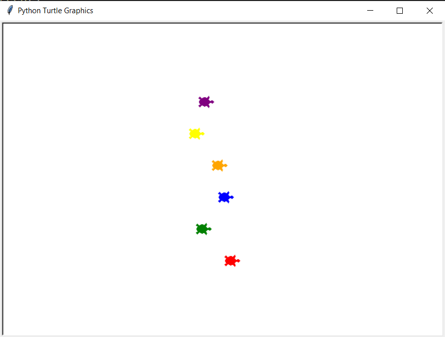

# Turtle_Race_Game

## Overview

### The challenge

Users should be able to:

- Select a turtle color among red, green, blue, orange, yellow and purple.
- Watch turtles that are running to win the race.
- Get a result from the terminal.

### Screenshot

### Built with

- Python
- turtle class
